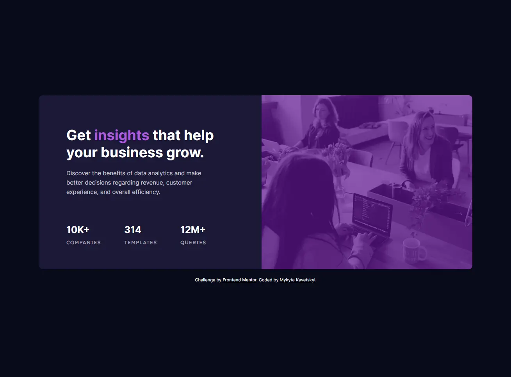
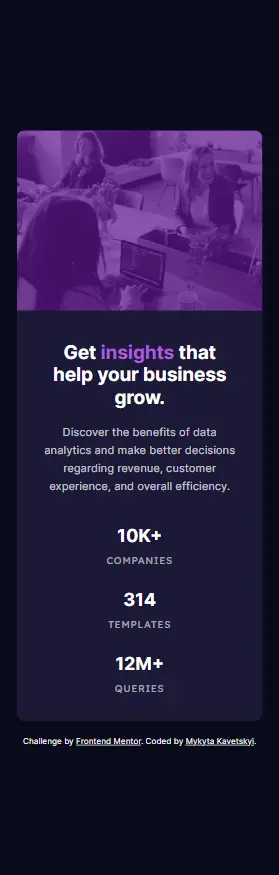

# Frontend Mentor - Stats preview card component solution

This is a solution to the [Stats preview card component challenge on Frontend Mentor](https://www.frontendmentor.io/challenges/stats-preview-card-component-8JqbgoU62). Frontend Mentor challenges help you improve your coding skills by building realistic projects.

## Table of contents

- [Overview](#overview)
  - [The challenge](#the-challenge)
  - [Screenshots](#screenshots)
  - [Links](#links)
- [My process](#my-process)
  - [Built with](#built-with)
  - [What I learned](#what-i-learned)
  - [Useful resources](#useful-resources)
- [Author](#author)

## Overview

### The challenge

Users should be able to:

- View the optimal layout depending on their device's screen size

### Screenshots

### Links

- Solution URL: [click-on-me](https://github.com/OniOdd/stats-preview-card-component)
- Live Site URL: [click-on-me](https://oniodd.github.io/stats-preview-card-component/)

## My process

### Built with

- Semantic HTML5 markup
- CSS custom properties
- Flexbox
- CSS Grid
- SASS (SCSS)
- BEM
- Mobile-first workflow

### What I learned

While doing this challenge, I practiced using the SASS preprocessor.

### Useful resources

- [MDN Web Docs](https://developer.mozilla.org/) - A useful informative resource.
- [About SASS](https://youtu.be/jfMHA8SqUL4?si=sDWW-62EGSeLdKtu) - A good video tutorial.
- [Code Guide](https://developer.mozilla.org/) - Standards for developing consistent, flexible, and sustainable HTML and CSS.

## Author

- LinkedIn - [Mykyta Kavetskyi](https://www.linkedin.com/in/mykyta-kavetskyi/)
- Facebook - [Mykyta Kavetskyi](https://www.facebook.com/profile.php?id=100094490807763)
- Twitter - [@OniOdd](https://twitter.com/OniOdd)
- Frontend Mentor - [@OniOdd](https://www.frontendmentor.io/profile/OniOdd)
